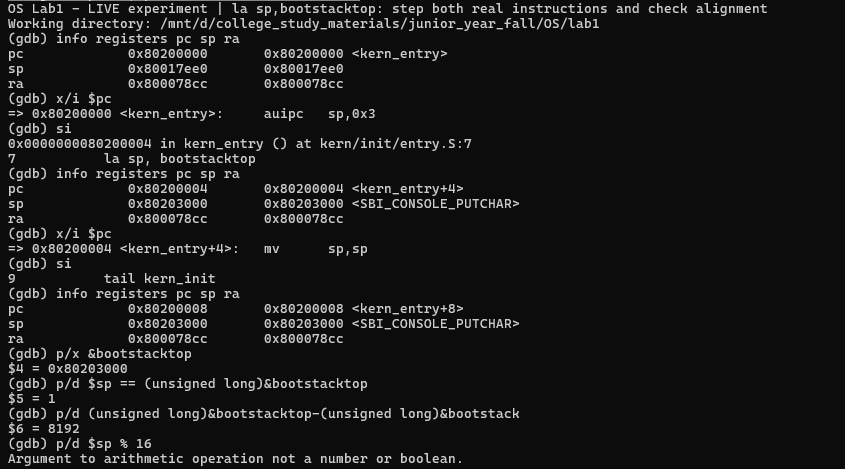
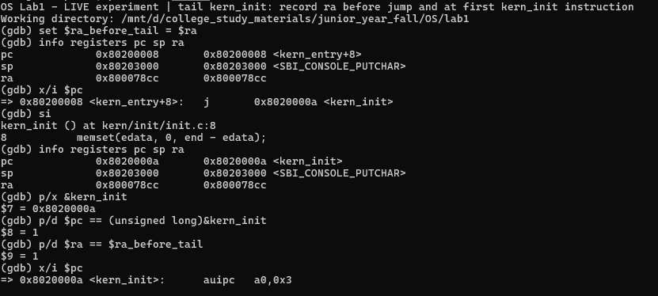
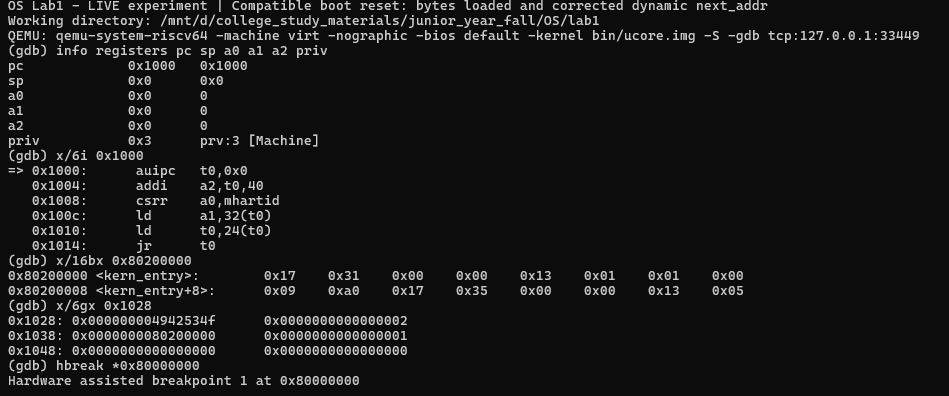
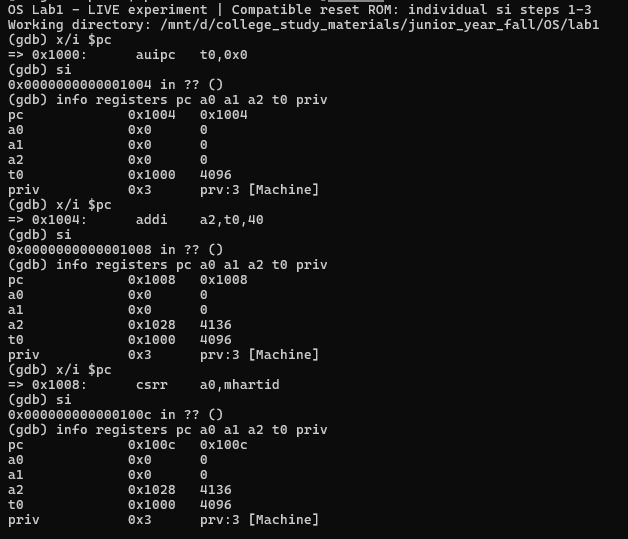
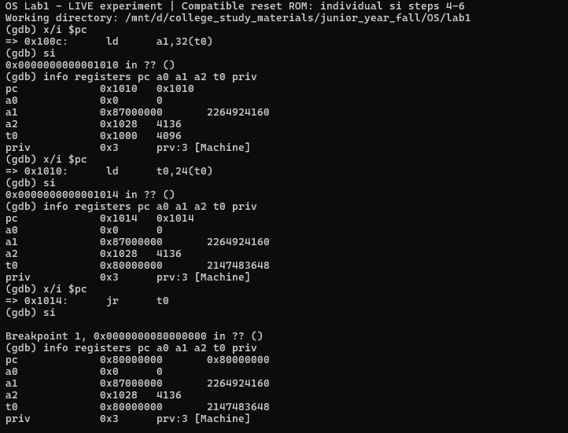
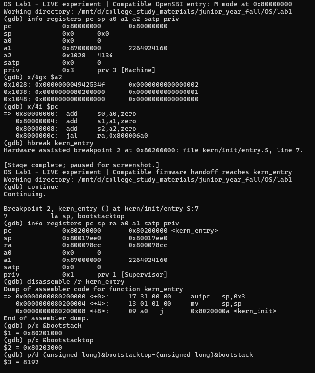
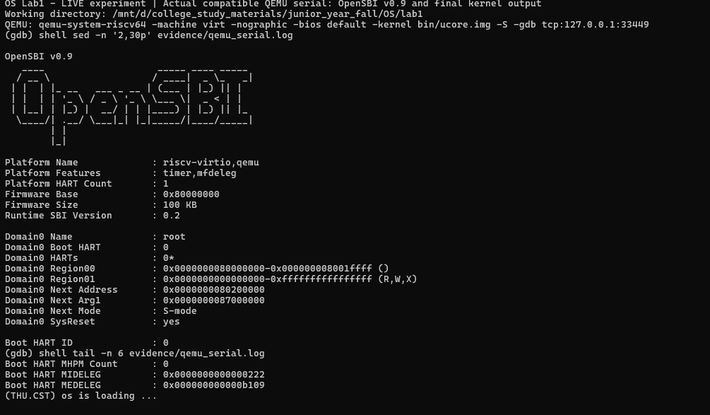

# 操作系统实验报告

## 实验基本信息

| 项目 | 内容 |
|---|---|
| 实验名称 | Lab1：最小内核的启动与调试 |
| 小组成员 | 朱泽帅、张宸笛号、马梓涵 |
| 完成日期 | 2026-10-04 |

### 小组分工

#### 练习如何分工？

| 成员 | 负责的练习或模块 |
|---|---|
| 朱泽帅 | 共同参与全部实验。主要负责内核入口与启动栈分析，包括 `entry.S`、`la sp, bootstacktop`、`tail kern_init` 及链接布局。 |
| 张宸笛号 | 共同参与全部实验。主要负责 QEMU 与 GDB 启动流程调试，包括 Reset ROM、OpenSBI 和 `kern_entry` 的跟踪与记录。 |
| 马梓涵 | 共同参与全部实验。主要负责 `kern_init`、SBI 输出流程、最终运行结果检查及实验截图整理。 |

#### 实验报告如何分工？

| 成员 | 负责的报告内容 |
|---|---|
| 朱泽帅 | 共同讨论全文，主要整理实验目的、整体逻辑和练习1。 |
| 张宸笛号 | 共同讨论全文，主要整理练习2、GDB 调试过程和观察结果。 |
| 马梓涵 | 共同讨论全文，主要整理测试与验证、实验总结、图片和最终排版。 |

## 一、实验目的

1. 阅读最小内核的源码和构建文件，理解交叉编译、链接和镜像生成的过程。
2. 理解 kern_entry 中建立启动栈、跳转到 C 函数的操作及其作用。
3. 使用 GDB 跟踪 QEMU 模拟的 RISC-V 启动过程，观察 reset ROM、OpenSBI 和内核入口之间的跳转。
4. 理解 kern_init 的初始化过程，以及内核通过 SBI 输出字符的方式。

## 二、实验环境

实验在 Windows 的 WSL2 Ubuntu 中完成，工程目录映射为 `/mnt/d/college_study_materials/junior_year_fall/OS/lab1`。

| 软件或环境 | 版本 |
|---|---|
| Ubuntu | 22.04.5 LTS |
| Linux 内核 | 6.6.87.2-microsoft-standard-WSL2 |
| RISC-V GCC | 10.2.0 |
| GDB | 12.1 |
| QEMU | 6.2.0 |
| OpenSBI | 实际启动版本 v0.9 |
| GNU Make | 4.3 |

`-bios default` 使用的是 QEMU 自带的 `/usr/share/qemu/opensbi-riscv64-generic-fw_dynamic.bin`，启动画面显示 OpenSBI v0.9。系统虽然另外安装了 OpenSBI 1.3 软件包，但实验启动时没有使用该包中的固件。

使用的 AI 工具如下：

| 成员 | AI 编程工具 | 底层模型 | 备注 |
|---|---|---|---|
| 朱泽帅 | Codex 桌面应用 | GPT-6 | 辅助阅读源码、分析调试输出和整理报告 |
| 张宸笛号 | Codex 桌面应用 | GPT-6 | 辅助阅读源码、分析调试输出和整理报告 |
| 马梓涵 | Codex 桌面应用 | GPT-6 | 辅助阅读源码、分析调试输出和整理报告 |

## 三、实验整体逻辑分析

### 3.1 本章节的逻辑主线

Lab1 的主线是让一个最小内核从启动入口运行到 C 初始化函数，并输出启动信息。首先，Makefile 把 C 和汇编源码交叉编译为 RISC-V 目标文件，再按照链接脚本生成内核 ELF 和裸二进制镜像。QEMU 将固件和内核装入模拟内存，CPU 从 reset ROM 开始执行，经 OpenSBI 初始化后进入内核。

在进入 C 初始化函数前，需要建立内核自己的栈。因此，kern_entry 先设置 sp，再跳转到 kern_init。后者完成 BSS 初始化，调用 cprintf 打印信息，最后进入无限循环。整个流程可以概括为：

```text
源码 -> 交叉编译与链接 -> bin/kernel -> bin/ucore.img
                                   |
Reset ROM -> OpenSBI -> kern_entry -> kern_init -> SBI 输出
```

### 3.2 功能的逐步实现

1. **确定内核布局并生成镜像。** 链接脚本规定代码、只读数据、数据和 BSS 的位置，使内核有明确的入口和加载地址。
2. **完成固件到内核的交接。** reset ROM 准备启动参数，OpenSBI 在 M-mode 初始化后，将控制权交给 S-mode 内核。
3. **建立启动栈。** kern_entry 设置栈顶，后续 C 函数才能保存寄存器和进行函数调用。
4. **初始化并输出信息。** kern_init 调用 memset 和 cprintf，通过 SBI 完成字符输出，再进入 while (1)。

这些功能已经包含在实验提供的代码中，实验主要通过阅读源码和 GDB 调试来理解它们，没有修改内核源码。

## 四、实验内容与实现

### 4.1 功能模块一：内核内存布局与镜像构建

**负责人：朱泽帅、张宸笛号、马梓涵**

#### 模块功能描述

本模块分析课程代码如何生成可加载的内核镜像，以及内核入口和启动栈在内存中的位置。

**涉及的核心文件和函数：**

- `Makefile`
- `tools/kernel.ld`
- `kern/init/entry.S`
- `kern_entry`

使用课程提供的原始代码，没有修改内核实现。

#### 功能说明

Makefile 使用 riscv64-unknown-elf-gcc 编译 C 和汇编文件，使用链接器将目标文件合并为 `bin/kernel`。宿主机运行的是 x86_64 程序，而生成的内核机器码属于 RISC-V，这就是交叉编译。

`tools/kernel.ld` 中的关键设置为：

```ld
OUTPUT_ARCH(riscv)
ENTRY(kern_entry)
BASE_ADDRESS = 0x80200000;
```

ENTRY(kern_entry) 指定 ELF 入口，BASE_ADDRESS 指定内核起始地址。链接脚本依次安排各节：

| 节 | 主要内容及作用 |
|---|---|
| .text | 内核机器指令，包括入口和各个函数 |
| .rodata | 字符串等只读数据 |
| .data、.sdata | 已初始化的数据；启动栈空间也位于 .data |
| .bss | 未初始化的数据，由 edata 和 end 标记清零区间 |

数据段按 0x1000 字节对齐。生成 ELF 后，Makefile 执行 `objcopy --strip-all -O binary`，得到 `bin/ucore.img`。ELF 保留符号和调试信息，供 GDB 使用；裸二进制镜像用于 QEMU 加载。

从 ELF 符号表和 GDB 中读到的关键值为：

| 项目 | 地址或大小 |
|---|---|
| ELF 入口 | 0x80200000 |
| kern_entry | 0x80200000 |
| kern_init | 0x8020000a |
| bootstack | 0x80201000 |
| bootstacktop | 0x80203000 |
| 启动栈大小 | 8192 Bytes |

QEMU 的 virt 机器模拟 RISC-V CPU、内存和外设，OpenSBI 则负责启动前的机器态初始化，并向内核提供 SBI 服务。它们共同为最小内核运行提供环境。

QEMU 在 CPU 开始运行前将固件和内核镜像装入模拟内存。内核位于 0x80200000；OpenSBI 完成机器态初始化后，根据下一阶段入口地址交接到 kern_entry。课程原始加载参数在本机环境下没有完成这次交接，处理过程如下。

#### 调试过程与问题处理

课程 Makefile 原来的 QEMU 加载参数为：

```bash
-bios default \
-device loader,file=bin/ucore.img,addr=0x80200000
```

在 QEMU 6.2.0 和 OpenSBI v0.9 环境下，运行后显示 Domain0 Next Address=0x0。虽然内核镜像已经放在 0x80200000，固件却没有取得正确的下一阶段入口。继续执行后，PC 停在 0x0，没有进入 kern_entry，也没有打印内核启动信息。

保存原运行记录后，将命令行的加载参数改为：

```bash
-kernel bin/ucore.img
```

重新启动后，Domain0 Next Address 变为 0x80200000，成功进入 kern_entry，并输出 `(THU.CST) os is loading ...`。这项调整只针对运行命令，没有修改 Makefile 和内核源码。

因此，本模块的调整发生在 QEMU 启动参数上，内核实现保持课程提供的原样。

### 4.2 功能模块二：最小内核初始化与 SBI 输出

**负责人：朱泽帅、张宸笛号、马梓涵**

#### 模块功能描述

本模块分析进入 C 初始化函数后，内核如何清理 BSS、输出启动信息并停留在循环中，以及字符输出如何交给 OpenSBI 处理。

**涉及的核心函数：**

- `kern_init()`
- `memset()`
- `cprintf()`
- `vcprintf()`
- `vprintfmt()`
- `cons_putc()`
- `sbi_console_putchar()`
- `sbi_call()`

#### 功能说明

`kern/init/init.c` 中的 kern_init() 主要完成三件事：

```c
memset(edata, 0, end - edata);
const char *message = "(THU.CST) os is loading ...\n";
cprintf("%s\n\n", message);
while (1)
    ;
```

memset 用于清理 BSS。调试时读到 edata=end=0x80203008，所以实际传入的长度为 0，函数直接返回。随后 cprintf 按格式串输出启动信息，while (1) 防止初始化函数返回。打印结束后，程序停留在 0x8020003a 的自跳转指令。关闭循环处的断点后，连续单步四次，PC 都保持这个值。

源码中的调用链为：

```text
cprintf -> vcprintf -> vprintfmt -> cputch -> cons_putc
        -> sbi_console_putchar -> sbi_call -> ecall -> OpenSBI
```

cprintf 收集可变参数后交给 vcprintf，后者调用 vprintfmt 处理格式串。vprintfmt 通过 cputch 逐个输出字符，再由 cons_putc 调用 sbi_console_putchar。最后，sbi_call 把服务号和参数写入寄存器，并执行 ecall。

uCore 内核运行在 S-mode，通过 ecall 请求 M-mode 的 OpenSBI 完成字符输出。最终串口输出为 `(THU.CST) os is loading ...`，见[图7](#user-content-fig-qemu-output)。

#### 调试过程与问题处理

该模块没有新增代码，也没有修改现有功能，实际工作是对原始代码进行调试验证。

最初在 0x80200492 的 ecall 处执行 si，GDB 直接停在返回后的 0x80200496。为了观察固件处理服务时的状态，随后读取 mtvec，并在固件异常入口 0x80000520 设置硬件断点。

调试字符 T 时，在 0x80200492 的 ecall 前观察到 a0=0x54、a7=1；在 SBI 异常处理入口 0x80000520 命中硬件断点后，priv=3、mcause=9，mepc=0x80200492。处理完成后，CPU 返回 0x80200496，恢复 S-mode。由此确认字符输出确实经过了 S-mode 内核到 M-mode OpenSBI 的服务调用。

### 4.3 练习一：理解内核启动中的程序入口操作

**负责人：朱泽帅、张宸笛号、马梓涵**

**练习原题：** 说明指令 `la sp, bootstacktop` 完成了什么操作，目的是什么？`tail kern_init` 完成了什么操作，目的是什么？

`kern/init/entry.S` 中的入口代码为：

```asm
kern_entry:
    la sp, bootstacktop
    tail kern_init
```

#### 1. `la sp, bootstacktop` 完成什么操作？

这条指令把 `bootstacktop` 的地址写入栈指针寄存器 `sp`，即 `sp = bootstacktop`。

本次调试中，`bootstacktop = 0x80203000`。进入 kern_entry 时，sp 原来保存的是 `0x80017ee0`；执行 la 后，sp 才变为 uCore 自己准备的栈顶地址 `0x80203000`。

实际反汇编中，la 展开为两条机器指令：

```asm
0x80200000: auipc sp,0x3
0x80200004: mv    sp,sp
```

第一条 auipc 把当前 PC 加上 0x3000，得到 0x80203000；第二条实际是 addi sp,sp,0，显示为别名 mv sp,sp，sp 保持不变。[图1](#user-content-fig-la-stack)记录了这两条指令的单步结果。

#### 2. `la sp, bootstacktop` 的目的是什么？

它的目的是给 uCore 建立自己的内核启动栈。

随后要执行 C 函数 kern_init()，C 函数调用需要使用栈保存局部变量、返回地址和寄存器等数据，所以应先设置 sp，再进入 C 代码。本次启动栈的范围为：

```text
bootstack    = 0x80201000
bootstacktop = 0x80203000
大小 = 0x80203000 - 0x80201000 = 0x2000 = 8192 Bytes
```

栈从高地址向低地址增长，所以初始 sp 指向 bootstacktop。栈顶地址是 16 的整数倍，符合栈对齐要求。[图1](#user-content-fig-la-stack)中的 `$sp % 16` 因寄存器类型而报错，后续改用 `((unsigned long)&bootstacktop) % 16` 计算，结果为 0。

#### 3. `tail kern_init` 完成什么操作？

这条指令把 CPU 的执行位置直接跳转到 kern_init()。本次 `kern_init = 0x8020000a`，链接后的 tail 指令为：

```asm
0x80200008: j 0x8020000a <kern_init>
```

执行前，PC=0x80200008、ra=0x800078cc；单步后，PC=0x8020000a，停在 kern_init 的第一条机器指令前，ra 仍为 0x800078cc。说明这次 tail 没有像普通 call 那样建立新的返回地址，结果见[图2](#user-content-fig-tail-kern-init)。

#### 4. `tail kern_init` 的目的是什么？

它的目的是把执行流程从汇编入口 kern_entry 交给 C 语言编写的 kern_init()，从这里开始执行内核初始化。

kern_init 最后进入 `while (1);`，不会返回，因此不需要再回到 kern_entry。

<a id="fig-la-stack"></a>


<a id="fig-tail-kern-init"></a>


### 4.4 练习二：使用 GDB 验证启动流程

**负责人：朱泽帅、张宸笛号、马梓涵**

**练习原题：** 请使用 GDB 跟踪 QEMU 模拟的 RISC-V 从加电开始，直到执行内核第一条指令（跳转到 0x80200000）的整个过程。通过调试，请思考并回答：RISC-V 硬件加电后最初执行的几条指令位于什么地址？它们主要完成了哪些功能？请在报告中简要记录你的调试过程、观察结果和问题的答案。

#### 4.4.1 调试过程

1. 使用 QEMU 调试模式启动虚拟机，`-S` 使 CPU 在执行第一条指令前暂停，`-gdb` 开放远程调试接口。实际使用的启动命令如下，加载参数的调整经过在4.1节说明。

```bash
qemu-system-riscv64 -machine virt -nographic -bios default \
  -kernel bin/ucore.img -S -gdb tcp:127.0.0.1:33449
```

2. 使用 GDB 读取 bin/kernel 的调试符号，并连接 QEMU，没有使用 GDB load：

```gdb
file bin/kernel
set architecture riscv:rv64
set pagination off
target remote localhost:33449
```

3. 读取初始寄存器和 ROM 指令：

```gdb
info registers pc sp a0 a1 a2 priv
x/6i 0x1000
```

4. 用 `hbreak *0x80000000` 设置 OpenSBI 入口硬件断点。从 0x1000 开始，每次查看当前指令、执行一次 si，再读取寄存器。执行完 ROM 的最后一条指令后，读取 OpenSBI 入口处的状态。

```gdb
x/i $pc
si
info registers pc a0 a1 a2 t0 priv
```

5. 在 OpenSBI 入口处执行 `hbreak kern_entry`，在内核第一条指令处设置硬件断点，再使用 `continue` 运行 OpenSBI 初始化。
6. 命中 kern_entry 后，读取 PC、sp、ra、a0、a1、satp 和 priv，并反汇编入口代码。随后执行一次 si，观察内核第一条机器指令执行后的状态。

#### 4.4.2 观察结果

GDB 连接后观察到 `PC = 0x1000`、`priv = 3`，CPU 处于 M-mode。此时 sp、a0、a1、a2 均为 0，[图3](#user-content-fig-reset-pc)显示了初始寄存器和 ROM 反汇编。

<a id="fig-reset-pc"></a>


逐条执行后，实际观察到的 PC 顺序为：

```text
0x1000 -> 0x1004 -> 0x1008 -> 0x100c
       -> 0x1010 -> 0x1014 -> 0x80000000
```

<a id="fig-reset-rom-first"></a>


[图4](#user-content-fig-reset-rom-first)和[图5](#user-content-fig-reset-rom-last)分别记录了前三条和后三条 ROM 指令的单步过程。执行 jr t0 后，GDB 在 0x80000000 命中 OpenSBI 入口断点，CPU 仍处于 M-mode。继续执行 OpenSBI 后，在 `PC = 0x80200000` 命中 kern_entry，`priv = 1`，此时已进入 S-mode。两处断点的实际状态如下，截图见[图6](#user-content-fig-opensbi-kern-entry)。

| 位置 | PC | 特权模式 |
|---|---|---|
| Reset ROM 起点 | 0x1000 | M-mode（priv=3） |
| OpenSBI 入口 | 0x80000000 | M-mode（priv=3） |
| kern_entry | 0x80200000 | S-mode（priv=1） |

到达 OpenSBI 入口时，`sp=0`、`a0=0`、`a1=0x87000000`、`a2=0x1028`、`satp=0`。进入 kern_entry 时，`sp=0x80017ee0`、`ra=0x800078cc`，a0、a1 和 satp 保持上述值。

实际观察到的启动过程为：

```text
0x1000 Reset ROM
    -> 0x80000000 OpenSBI（M-mode）
    -> 0x80200000 kern_entry（S-mode）
```

<a id="fig-reset-rom-last"></a>


<a id="fig-opensbi-kern-entry"></a>


Reset ROM 部分逐条执行，OpenSBI 初始化部分使用 continue 运行到内核断点。kern_entry 的第一条机器指令为 `auipc sp,0x3`；执行一次 si 后，PC 变为 0x80200004，sp 变为 0x80203000，如[图1](#user-content-fig-la-stack)所示。

六次 ROM 单步后的关键寄存器记录如下。这个过程中 priv 始终为 3，即 M-mode。

| 单步时 PC 的变化 | 执行后关键寄存器 |
|---|---|
| `0x1000 -> 0x1004` | t0=0x1000 |
| `0x1004 -> 0x1008` | a2=0x1028，t0=0x1000 |
| `0x1008 -> 0x100c` | a0=0，a2=0x1028 |
| `0x100c -> 0x1010` | a1=0x87000000 |
| `0x1010 -> 0x1014` | t0=0x80000000 |
| `0x1014 -> 0x80000000` | t0=0x80000000，priv=3 |

#### 4.4.3 问题一：RISC-V 硬件加电后最初执行的几条指令位于什么地址？

在本次 QEMU 6.2.0 实验中，RISC-V CPU 加电后从地址 `0x1000` 开始执行 Reset ROM。实际观察到的最初六条指令为：

| 地址 | 指令 |
|---|---|
| 0x1000 | auipc t0,0x0 |
| 0x1004 | addi a2,t0,40 |
| 0x1008 | csrr a0,mhartid |
| 0x100c | ld a1,32(t0) |
| 0x1010 | ld t0,24(t0) |
| 0x1014 | jr t0 |

因此，本实验中 RISC-V 硬件加电后最初执行的代码位于以 `0x1000` 为起点的 Reset ROM 中。

#### 4.4.4 问题二：这些指令主要完成哪些功能？

这些指令主要为 OpenSBI 准备启动参数，取得 OpenSBI 的入口地址，最后跳转到 OpenSBI 开始执行。各条指令的作用如下：

1. **`0x1000: auipc t0,0x0`**：取得当前 PC，令 t0=0x1000，后续将它作为访问 Reset ROM 数据的基址。
2. **`0x1004: addi a2,t0,40`**：令 a2 指向 OpenSBI 使用的 dynamic firmware 信息，实际 a2=0x1028。
3. **`0x1008: csrr a0,mhartid`**：读取当前 hart ID 到 a0，实际 a0=0，表示当前启动的是 hart 0。
4. **`0x100c: ld a1,32(t0)`**：从 Reset ROM 数据中取得设备树地址，实际 a1=0x87000000。
5. **`0x1010: ld t0,24(t0)`**：取得 OpenSBI 的入口地址，实际 t0=0x80000000。
6. **`0x1014: jr t0`**：跳转到 0x80000000，开始执行 OpenSBI。

因此，这几条指令准备了 hart ID、设备树地址和 OpenSBI 动态启动信息，并将 CPU 控制权转移到 OpenSBI。OpenSBI 完成初始化后，再进入 0x80200000，即 uCore 的 kern_entry。

## 五、测试与验证

1. **构建检查。** 已有构建产物 bin/kernel 和 bin/ucore.img。再次执行 make 返回 0，提示 `Nothing to be done for 'TARGETS'.`。
2. **原启动参数。** OpenSBI 可以启动，但下一阶段地址为 0，没有进入内核。
3. **调整启动参数后。** CPU 经 OpenSBI 进入 kern_entry，完成 la、tail，打印启动字符串后进入循环。
4. **自动评分。** 未运行 `make grade`。

入口与启动调试见[图1](#user-content-fig-la-stack)至[图2](#user-content-fig-tail-kern-init)、[图3](#user-content-fig-reset-pc)、[图4](#user-content-fig-reset-rom-first)、[图5](#user-content-fig-reset-rom-last)和[图6](#user-content-fig-opensbi-kern-entry)，最终输出见[图7](#user-content-fig-qemu-output)。

<a id="fig-qemu-output"></a>


## 六、实验总结与收获

### 对操作系统的理解

通过源码阅读和单步调试，可以把实验中的操作与 OS 原理联系起来：

| 实验内容 | OS 原理知识 | 联系和区别 |
|---|---|---|
| Reset Vector 和 reset ROM | 系统启动 | CPU 从约定地址取指，启动代码为后续执行准备参数；这里观察的是 QEMU 模拟平台 |
| OpenSBI | Firmware | 固件先于内核运行，完成底层初始化，并提供运行时服务 |
| M-mode 与 S-mode | 特权级保护 | 固件与内核处于不同特权级，进入内核时从 M-mode 切换到 S-mode |
| kernel.ld | 地址空间与程序装载 | 链接脚本规定程序布局；Lab1 使用固定加载地址，尚未建立分页映射 |
| ELF 与 BIN | 可执行文件和镜像 | ELF 含符号、节和调试信息；BIN 保存按布局生成的原始字节 |
| bootstack | 函数调用栈 | C 函数调用依赖栈空间和对齐约定，入口汇编先建立栈环境 |
| ecall | 异常与特权级切换 | S-mode 内核通过环境调用进入 M-mode，请求固件处理服务 |
| SBI | 内核与固件接口 | 内核通过标准接口请求底层服务；这里使用的是控制台输出服务 |

Lab1 还没有涉及进程与线程、调度、上下文切换、虚拟内存与页表、文件系统，以及用户态程序到内核的系统调用。这些内容需要在后续实验中继续学习。

### AI 协作开发的经验

这次实验中，AI 主要帮助我梳理启动流程、检查 GDB 输出和整理报告。实际调试发现，教材示例的 QEMU 和 OpenSBI 版本与本机并不完全一致，直接照抄示例中的寄存器值和指令数容易出错。遇到无法进入内核的问题后，对照启动画面和断点位置，才找到了加载参数的问题。AI 的解释可以帮助理解代码，但最终还是要以自己运行得到的 PC、寄存器和输出为准。
